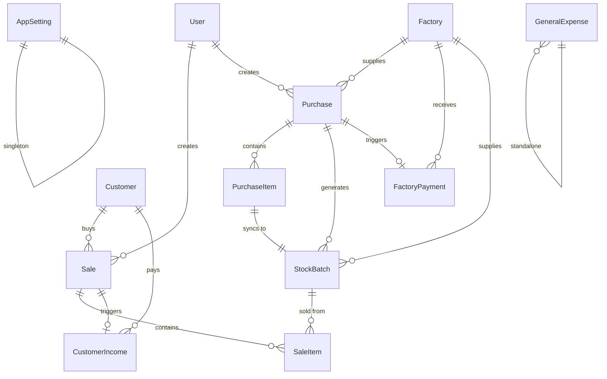

<p align="center">
  <h1 align="center">📦 Wholesale Management System</h1>
  <p align="center">
    A full-stack business management platform built for wholesale distributors.<br/>
    Track purchases, inventory, sales, payments, expenses — and see it all on a real-time analytics dashboard.
  </p>


<p align="center">
  
  
  
  
  
  
</p>

---

## Table of Contents

- [Overview](#overview)
- [Features](#features)
- [Tech Stack](#tech-stack)
- [Architecture](#architecture)
- [Project Structure](#project-structure)
- [Getting Started](#getting-started)
  - [Prerequisites](#prerequisites)
  - [Backend Setup](#backend-setup)
  - [Frontend Setup](#frontend-setup)
- [Environment Variables](#environment-variables)
- [API Reference](#api-reference)
- [Data Model](#data-model)
- [Contributing](#contributing)
- [License](#license)

---

## Overview

**Wholesale Management System** is a comprehensive, production-ready application designed for wholesale businesses to manage their entire operation from a single platform. It replaces manual bookkeeping with an automated system that handles purchase tracking, batch-level inventory management, invoiced sales, multi-party payment ledgers, and expense recording — all surfaced through a rich analytics dashboard.

The system is architected as a decoupled **Django REST API** backend with a **React** single-page application frontend, connected via JWT authentication and RESTful endpoints.

---

## Features

### 🔐 Authentication & Security
- Email-based user registration and login
- JWT access + refresh token authentication with automatic rotation
- Token blacklisting on logout
- Password reset via email (SMTP integration)
- Change password for authenticated users
- Automatic token refresh on 401 responses (seamless UX)

### 📊 Analytics Dashboard
- **Main dashboard** — KPI cards (total revenue, profit, expenses, outstanding balances)
- **Sales trend** — Revenue over time (daily / weekly / monthly)
- **Profit trend** — Gross profit, expenses, and net profit breakdown
- **Top products** — Best-selling items ranked by volume or revenue
- **Top customers** — Highest-value customers
- **Overdue customers** — Customers with outstanding balances and days since last payment
- **Stock overview** — Full inventory health report (low stock, sold out, stock value)
- **Payment method distribution** — Breakdown by Cash, Telebirr, CBE, BOA, Awash
- **Expense breakdown** — Categorized spending analysis
- **Factory & customer balances** — Outstanding amounts owed to/from all parties
- **Revenue vs. expenses** — Side-by-side comparison chart
- **Inventory aging** — Age-bucketed stock analysis
- **Product performance** — Fast / slow / dead stock classification

### 🏭 Factory (Supplier) Management
- Full CRUD for factories/suppliers
- Track contact info, location, and initial balances
- Computed current balance (initial + total purchases − payments made)
- Purchase and payment history per factory

### 👥 Customer Management
- Full CRUD with active/archive status
- Track initial credit balances (pre-system debt)
- Computed current balance (initial credit + sale credit − payments received)
- Sales history, payment history, and days-since-last-payment tracking

### 🛒 Purchase Management
- Create purchase orders linked to a factory
- Add multiple line items per purchase (item code, product name, bags, pieces per bag, price)
- Auto-generated shipping codes
- Automatic total calculation (per-piece or per-bag pricing)
- Automatic stock batch creation in inventory on save
- Payment status tracking (Unpaid / Partial / Fully Paid)
- Edit/delete guards — purchases with sold stock are protected

### 📦 Inventory & Stock
- **Batch-level tracking** — Every purchase item creates a unique stock batch
- Real-time remaining bags/pieces calculation
- Cost-per-piece normalization (handles per-bag and per-piece pricing)
- Stock value computation at cost
- Low stock alerts (configurable threshold percentage)
- Sold-out detection
- **Inventory summary** — Aggregated view grouped by item code across all batches
- Available stock filtering

### 💰 Sales & Invoicing
- Create sales linked to a customer with multiple line items
- Each sale item draws from a specific stock batch
- Stock validation — cannot sell more than available
- Automatic invoice number generation (`INV-YYYYMMDD-NNNN`)
- Support for per-piece and per-bag selling prices
- Payment types: Cash, Credit, Partial Payment (auto-determined)
- Automatic stock deduction on sale
- Per-item profit calculation (selling price − purchase cost × quantity)
- PDF invoice generation via ReportLab

### 💳 Payments & Expenses
- **Customer income** — Record payments received from customers (auto-created from cash sales, or manual entry)
- **Factory payments** — Record payments made to factories (auto-created from purchases, or manual entry)
- **General expenses** — Track business expenses with auto-generated reference numbers
- Payment methods: Cash, Telebirr, CBE, BOA, Awash, Other
- Receipt and payment number auto-generation

### ⚙️ App Settings
- Singleton configuration (business name, phone, address)
- Configurable low stock alert threshold
- Default currency and available currencies list (e.g., ETB, USD)

---

## Tech Stack

### Backend
| Technology | Purpose |
|---|---|
| **Python 3.12+** | Runtime |
| **Django 6.0** | Web framework |
| **Django REST Framework 3.17** | RESTful API |
| **SimpleJWT** | JWT authentication |
| **django-filter** | Query parameter filtering |
| **django-cors-headers** | Cross-origin request handling |
| **ReportLab** | PDF invoice generation |
| **python-decouple** | Environment variable management |
| **uv** | Package manager |
| **SQLite** | Database (development) |

### Frontend
| Technology | Purpose |
|---|---|
| **React 19** | UI framework |
| **Vite 8** | Build tool & dev server |
| **React Router 7** | Client-side routing |
| **TanStack React Query 5** | Server state management & caching |
| **Axios** | HTTP client with interceptors |
| **Recharts** | Data visualization / charts |
| **Sonner** | Toast notifications |
| **React Loading Skeleton** | Loading state placeholders |

---

## Architecture

```
┌─────────────────────────────────────────────────────┐
│                    Client (React)                    │
│                                                     │
│  React Router ──▶ Pages ──▶ Services ──▶ Axios API  │
│                              │                      │
│  TanStack Query (cache) ◀────┘                      │
│  Recharts (charts)                                  │
│  Sonner (toasts)                                    │
└────────────────────────┬────────────────────────────┘
                         │ REST / JSON
                         │ Bearer JWT
┌────────────────────────▼────────────────────────────┐
│                   Server (Django)                    │
│                                                     │
│  URL Router ──▶ ViewSets ──▶ Serializers ──▶ Models │
│                    │                                │
│  SimpleJWT ◀───────┘                                │
│  django-filter (query filtering)                    │
│  ReportLab (PDF generation)                         │
│  Custom Exception Handler                           │
└────────────────────────┬────────────────────────────┘
                         │
                    ┌────▼────┐
                    │ SQLite  │
                    └─────────┘
```

---

## Project Structure

```
wholesale-management/
├── server/                         # Django backend
│   ├── apps/
│   │   ├── accounts/               # User model, auth views (register, login, JWT, password reset)
│   │   ├── core/                   # Shared models (TimeStampedModel, AppSetting, PaymentMethod)
│   │   ├── customers/              # Customer CRUD, balance computation
│   │   ├── dashboard/              # Read-only analytics & aggregation endpoints
│   │   ├── factories/              # Factory/supplier CRUD, balance tracking
│   │   ├── inventory/              # StockBatch model, stock tracking
│   │   ├── payments/               # CustomerIncome, FactoryPayment, GeneralExpense
│   │   ├── purchases/              # Purchase + PurchaseItem, auto stock sync
│   │   └── sales/                  # Sale + SaleItem, invoice generation, stock deduction
│   ├── config/                     # Django project settings, URL routing, WSGI/ASGI
│   ├── invoice/                    # PDF invoice generation (purchases & sales)
│   ├── templates/                  # Email templates
│   ├── utils/                      # Custom exception handler, email utility, PDF theme
│   ├── manage.py
│   ├── pyproject.toml
│   ├── .env.example
│   └── .python-version             # Python 3.12
│
├── client/                         # React frontend
│   ├── src/
│   │   ├── components/
│   │   │   ├── common/             # Reusable UI (Badge, Button, Card, Form, Modal, Table, etc.)
│   │   │   ├── features/           # Feature-specific components (Dashboard widgets)
│   │   │   └── layout/             # App shell (MainLayout, Header, Sidebar, Footer, ProtectedRoute)
│   │   ├── hooks/                  # Custom React hooks (useExpenses, useInventory, useSales, etc.)
│   │   ├── pages/                  # Route pages
│   │   │   ├── Auth/               # Login, Signup, ForgotPassword, ResetPassword
│   │   │   ├── Dashboard/          # Analytics dashboard
│   │   │   ├── Customers/          # Customer list + detail
│   │   │   ├── Factories/          # Factory list + detail
│   │   │   ├── Purchases/          # Purchase list, create, detail
│   │   │   ├── Inventory/          # Stock batch list + detail
│   │   │   ├── InventorySummary/   # Aggregated stock view
│   │   │   ├── Sales/              # Sale list, create, detail
│   │   │   ├── Payments/           # Income + factory payment views
│   │   │   ├── Expenses/           # Expense list + detail
│   │   │   ├── Settings/           # Business configuration
│   │   │   └── NotFound/           # 404 page
│   │   ├── services/               # API service layer (Axios-based, one file per domain)
│   │   ├── config/                 # App configuration
│   │   ├── styles/                 # CSS stylesheets
│   │   ├── utils/                  # Utility functions
│   │   ├── App.jsx                 # Route definitions
│   │   ├── main.jsx                # Entry point (providers, QueryClient, Toaster)
│   │   ├── style.css               # Global styles
│   │   └── auth.css                # Authentication page styles
│   ├── index.html
│   ├── vite.config.js
│   └── package.json
│
├── .gitignore
└── README.md
```

---

## Getting Started

### Prerequisites

| Requirement | Version |
|---|---|
| Python | 3.12+ |
| Node.js | 18+ |
| uv | Latest ([install guide](https://docs.astral.sh/uv/)) |
| npm | 9+ |

### Backend Setup

```bash
# Navigate to the server directory
cd server

# Create virtual environment and install dependencies
uv sync

# Copy environment variables
cp .env.example .env
# Edit .env with your values (see Environment Variables section)

# Run database migrations
uv run python manage.py migrate

# Create a superuser (optional, for Django admin)
uv run python manage.py createsuperuser

# Start the development server
uv run python manage.py runserver
```

The API will be available at `http://localhost:8000/api/`.

### Frontend Setup

```bash
# Navigate to the client directory
cd client

# Install dependencies
npm install

# Start the development server
npm run dev
```

The app will be available at `http://localhost:5173/` (default Vite port).

---

## Environment Variables

Create a `.env` file in the `server/` directory based on `.env.example`:

| Variable | Description | Example |
|---|---|---|
| `ACCESS_TOKEN_EXPIRE_MINUTES` | JWT access token lifetime in minutes | `60` |
| `REFRESH_TOKEN_EXPIRE_DAYS` | JWT refresh token lifetime in days | `7` |
| `EMAIL_HOST` | SMTP server hostname | `smtp.gmail.com` |
| `EMAIL_PORT` | SMTP server port | `465` |
| `EMAIL_USE_TLS` | Enable TLS | `False` |
| `EMAIL_USE_SSL` | Enable SSL | `True` |
| `EMAIL_HOST_USER` | SMTP username / email | `your-email@gmail.com` |
| `EMAIL_HOST_PASSWORD` | SMTP password / app password | `your-app-password` |
| `DEFAULT_FROM_EMAIL` | Sender email address | `noreply@yourbusiness.com` |
| `ALLOWED_HOSTS` | Comma-separated allowed hosts | `localhost,127.0.0.1` |
| `FRONTEND_URL` | Frontend URL (used in password reset emails) | `http://localhost:5173` |

For the frontend, create a `.env` file in `client/` (optional):

| Variable | Description | Default |
|---|---|---|
| `VITE_API_URL` | Backend API base URL | `http://localhost:8000` |

---

## API Reference

All endpoints are prefixed with `/api/`. Authentication is required for all endpoints except auth routes.

### Authentication (`/api/auth/`)

| Method | Endpoint | Description |
|---|---|---|
| `POST` | `/auth/register/` | Register a new user |
| `POST` | `/auth/login/` | Login (returns access + refresh tokens) |
| `POST` | `/auth/refresh/` | Refresh access token |
| `POST` | `/auth/logout/` | Logout (blacklist refresh token) |
| `POST` | `/auth/forgot-password/` | Send password reset email |
| `POST` | `/auth/reset-password/` | Reset password with token |
| `POST` | `/auth/change-password/` | Change password (authenticated) |

### Dashboard (`/api/dashboard/`)

| Method | Endpoint | Description |
|---|---|---|
| `GET` | `/dashboard/` | Main KPI stats |
| `GET` | `/dashboard/sales-trend/` | Sales over time (supports `period`, `start_date`, `end_date`) |
| `GET` | `/dashboard/profit-trend/` | Profit breakdown over time |
| `GET` | `/dashboard/top-products/` | Best-selling products |
| `GET` | `/dashboard/top-customers/` | Highest-value customers |
| `GET` | `/dashboard/overdue-customers/` | Customers with outstanding balances |
| `GET` | `/dashboard/stock-overview/` | Inventory health report |
| `GET` | `/dashboard/payment-methods/` | Payment method distribution |
| `GET` | `/dashboard/expenses-breakdown/` | Expense categories |
| `GET` | `/dashboard/factory-balances/` | All factory balances |
| `GET` | `/dashboard/customer-balances/` | All customer balances |
| `GET` | `/dashboard/revenue-vs-expenses/` | Revenue vs expenses comparison |
| `GET` | `/dashboard/inventory-aging/` | Stock age analysis |
| `GET` | `/dashboard/product-performance/` | Fast/slow/dead stock |

### Core Resources

| Method | Endpoint | Description |
|---|---|---|
| `GET/PUT` | `/settings/` | App settings (singleton) |
| `CRUD` | `/customers/` | Customer management |
| `CRUD` | `/factories/` | Factory/supplier management |
| `CRUD` | `/purchases/` | Purchase orders (with nested items) |
| `CRUD` | `/purchase-items/` | Standalone purchase items |
| `CRUD` | `/sales/` | Sales (with nested items) |
| `CRUD` | `/sale-items/` | Standalone sale items |
| `GET` | `/stock/` | Stock batch list |
| `GET` | `/stock/summary/` | Aggregated stock by item code |
| `GET` | `/stock/available/` | Batches with remaining stock |
| `GET` | `/stock/low-stock/` | Low stock & sold out alerts |
| `CRUD` | `/income/` | Customer income records |
| `CRUD` | `/factory-payments/` | Factory payment records |
| `CRUD` | `/expenses/` | General expense records |

---

## Data Model



**Key relationships:**
- A **Purchase** from a **Factory** creates **PurchaseItems**, each of which auto-generates a **StockBatch** in inventory
- A **Sale** to a **Customer** contains **SaleItems**, each drawing from a specific **StockBatch** (with stock validation)
- **Payments** (CustomerIncome, FactoryPayment) can be auto-created from sales/purchases or manually entered
- **AppSetting** is a singleton (pk=1) for global business configuration

---

## Contributing

1. Fork the repository
2. Create a feature branch (`git checkout -b feature/your-feature`)
3. Commit your changes (`git commit -m 'Add your feature'`)
4. Push to the branch (`git push origin feature/your-feature`)
5. Open a Pull Request

---

## License

This project is licensed under the MIT License. See the [LICENSE](LICENSE) file for details.

---

<p align="center">
  Built with ❤️ for wholesale businesses
</p>
